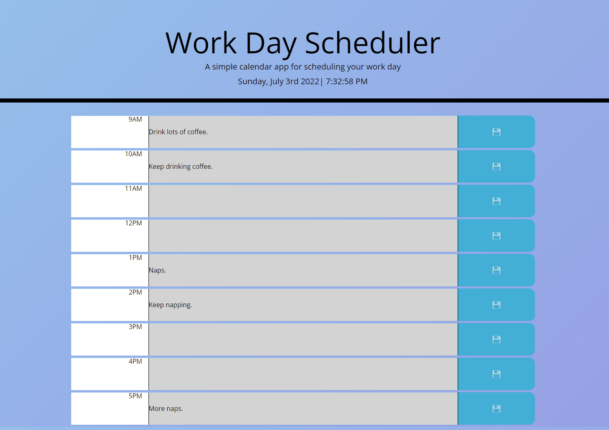
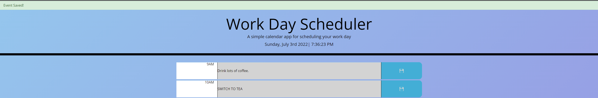

# M5-Personal-Calendar-App
## Purpose:
A learning experience designed to help understand utilization of local storage, JQuery, and the Bootstrap framework.

### Technologies Utilized
- HTML
- Bootstrap
- CSS
- Javascript
- JQuery
- JSON

# Landing Page
Once on the page, you are present with a timeslot for each working hour of the day (9AM - 5PM) that are colored coded to convey past, present, and future timeslots.
- 

## Changing Text:
- Click into the box (and change any existing text) and type your event name.
    - 
    - 

## Save Event:
- Hover over the blue button with the disk icon and click to save your data.
    - 
- When you click the save button, a green banner will appear letting you know the event is saved to local storage.
    - 

## Timeslot Colors:
- Green means the hour is in the FUTURE
    - 
- Red means that timeslot is the PRESENT hour
    - 
- Grey means the timeslot is in the PAST
    - 

